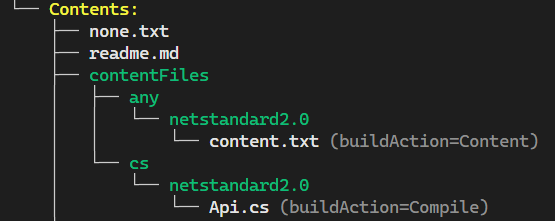

# Overview

> [!TIP]
> Run this example directly in your browser by navigating to the 
> `docs/scenarios/overview` folder and running `nugetize` in a 
> 

This example showcases the most basic usage of NuGetizer. 
It creates a NuGet package from a single project and uses some of the 
most common packaging metadata properties (which are fully compatible 
with the [SDK pack ones](https://learn.microsoft.com/en-us/nuget/reference/msbuild-targets#pack-target))

Run `dotnet restore` from this directory, and then run the `nugetize` 
[tool](https://nuget.org/packages/dotnet-nugetizer) to see the package 
layout that will be produced.

For the following project file:

[!code-xml]

The following package contents will be produced:

Highlights from the project file:

*  The standard [SDK pack](https://learn.microsoft.com/en-us/nuget/reference/msbuild-targets#pack-target) 
   MSBuild properties are used to specify the package metadata:

[!code-xml]

*  Generated XML API docs are included in the package alongside the binaries and 
   symbols, under the right target framework path:

[!code-xml]

*  NuGetizer itself is never considered a dependency of the package, even if it does not specify `PrivateAssets="all"` on its package reference.

*  The `Newtonsoft.Json` package reference becomes a dependency for the project's current target framework:

*  Since [NuGet.org surfaces source code repository information](https://devblogs.microsoft.com/nuget/introducing-source-code-link-for-nuget-packages/) and [using Source Link](https://devblogs.microsoft.com/dotnet/producing-packages-with-source-link/) is the recommended way to provide it, NuGetizer will automatically detect it in the project and populate the relevant metadata. In this package reference case, you can also see NuGetizer honoring the `PrivateAssets="all"` attribute and not including it as a dependency. The [PublishRepositoryUrl](https://github.com/dotnet/sourcelink/blob/main/docs/README.md#publishrepositoryurl) property controls whether the `ProjectUrl` and `RepositoryUrl` metadata are made public:

[!code-xml]
 

*  Built-in item groups like `None`, `Content` and `Compile` can be used or updated with `Pack=true` for inclusion in the package:

[!code-xml]

  Note how the `None` items are included in the package root by default while the `Content` items are included in the `contentFiles` folder and automatically follow the [contentFiles guidance](https://learn.microsoft.com/en-us/nuget/reference/nuspec#package-folder-structure). 
  
  > [!NOTE]
  > In another example we'll see how to further annotate these items to modify their `buildAction`, `copyToOutput` and `flatten` [behaviors](https://learn.microsoft.com/en-us/nuget/reference/nuspec#using-the-contentfiles-element-for-content-files).