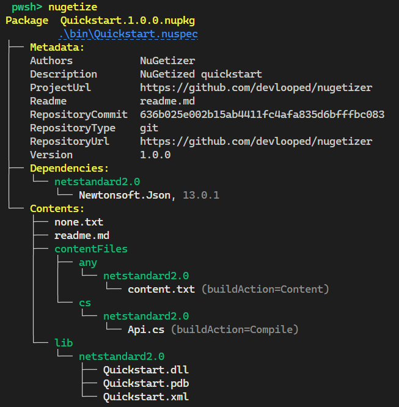
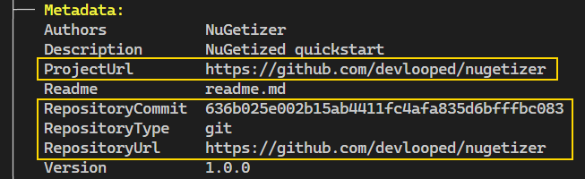

# Overview

> [!TIP]
> Run this example directly in your browser by navigating to the 
> `docs/scenarios/overview` folder and running `nugetize` in a 
> [](https://github.com/codespaces/new?hide_repo_select=true&ref=docs&repo=297430130&machine=basicLinux32gb&devcontainer_path=.devcontainer%2Fdevcontainer.json)

This example showcases the most basic usage of NuGetizer. 
It creates a NuGet package from a single project and uses some of the 
most common packaging metadata properties (which are fully compatible 
with the [SDK pack ones](https://learn.microsoft.com/en-us/nuget/reference/msbuild-targets#pack-target))

Run `dotnet restore` from this directory, and then run the `nugetize` 
[tool](https://nuget.org/packages/dotnet-nugetizer) to see the package 
layout that will be produced.

For the following project file:

[!code-xml[](Quickstart.csproj)]

The following package contents will be produced:




Highlights from the project file:

*  The standard [SDK pack](https://learn.microsoft.com/en-us/nuget/reference/msbuild-targets#pack-target) 
   MSBuild properties are used to specify the package metadata:

[!code-xml[](Quickstart.csproj#L7-L9)]

*  Generated XML API docs are included in the package alongside the binaries and 
   symbols, under the right target framework path:

[!code-xml[](Quickstart.csproj#L4-L5)]


*  NuGetizer itself is never considered a dependency of the package, even if it does not specify `PrivateAssets="all"` on its package reference.

*  The `Newtonsoft.Json` package reference becomes a dependency for the project's current target framework:


*  Since [NuGet.org surfaces source code repository information](https://devblogs.microsoft.com/nuget/introducing-source-code-link-for-nuget-packages/) and [using Source Link](https://devblogs.microsoft.com/dotnet/producing-packages-with-source-link/) is the recommended way to provide it, NuGetizer will automatically detect it in the project and populate the relevant metadata. In this package reference case, you can also see NuGetizer honoring the `PrivateAssets="all"` attribute and not including it as a dependency. The [PublishRepositoryUrl](https://github.com/dotnet/sourcelink/blob/main/docs/README.md#publishrepositoryurl) property controls whether the `ProjectUrl` and `RepositoryUrl` metadata are made public:

[!code-xml[](Quickstart.csproj#L11-L11)]
 


*  Built-in item groups like `None`, `Content` and `Compile` can be used or updated with `Pack=true` for inclusion in the package:

[!code-xml[](Quickstart.csproj#L21-L25)]


  Note how the `None` items are included in the package root by default while the `Content` items are included in the `contentFiles` folder and automatically follow the [contentFiles guidance](https://learn.microsoft.com/en-us/nuget/reference/nuspec#package-folder-structure). 
  
  > [!NOTE]
  > In another example we'll see how to further annotate these items to modify their `buildAction`, `copyToOutput` and `flatten` [behaviors](https://learn.microsoft.com/en-us/nuget/reference/nuspec#using-the-contentfiles-element-for-content-files).

  *  If a `readme.md` (or `.txt`) file is present in the project directory, it is automatically included in the package as the [readme file to be rendered by nuget.org](https://learn.microsoft.com/en-us/NuGet/nuget-org/package-readme-on-nuget-org). See [an example of a comprehensive readme](https://www.nuget.org/packages/ThisAssembly.Constants).


----

## PackageFile All The Things

At its core, NuGetizer just packs any `<PackageFile>` in your project. These items can declare the following metadata to affect the resulting location of a file in the package:

| Metadata | Description |
|----------|-------------|
| PackagePath | The relative path of the file within the package. |
| PackFolder | The [known folder](TODO://LINK) within the package where the file will be placed. |
| FrameworkSpecific | Whether the `PackFolder` should be considered as framework-specific. |

When `PackagePath` is provided, it determines the precise location of the file within the package and the other attributes are ignored. 

When `PackFolder` is provided (i.e. `lib` or `build`), the `FrameworkSpecific` metadata complements it by optionally appending the project target framework automatically.

For example, given the following [project file](docs/scenarios/quickstart/Quickstart.csproj):

[!code-xml[](docs/scenarios/quickstart/packagefile/Quickstart.csproj)]


Note the relationship between the metadata in each of the  `PackageFile` items and their resulting placement within the package.

It might seem that the `lib` folder is "special" since it got some items we didn't declare as `PackageFile` at all, namely, the project's main build output. But that's not the case at all. If we set the following property at the project level:

```xml
<EnablePackInference>false</EnablePackInference>
```

The `nugetize` output will now be:


This introduces the concept of *package contents inference*, where certain heuristics turn common packing scenarios into *implicit* `PackageFile` items, such as the primary build output shown above.

## Package Contents Inference

A set of built-in rules (enabled by default) turn common MSBuild items into `PackageFile` to make common packing scenarios more intuitive and automatic. These rules can be turned off as mentioned by setting `EnablePackInference=false`.

The rules attempt to map common items to [known NuGet package folders](TODO://LINK), such as `lib`, `build` or `contentFiles` by transforming them into corresponding `PackageFile` items, just as if you had added them by hand, annotating them with the corresponding `PackFolder` and (optional) `FrameworkSpecific` metadata.

### PackFolder and FrameworkSpecific

NuGetizer leverages the concept of `PackageFile` for *all* content within a package, not just files. For example,  dependencies (via `PackageReference`s) and framework references (via `Reference`) are turned into `PackageFile`s with `PackFolder=Dependency` and `PackFolder=FrameworkReference` respectively. Even the package metadata itself is just another `PackageFile`! (with `PackFolder=Metadata`)

This allows extending *all* packing content (inferred or otherwise) via plain MSBuild item manipulation, and provides unparalelled consistency and extensibility.

When an item specifies *FrameworkSpecific=true*, the project's target framework is added to the final package path, such as `lib\netstandard2.0\My.dll`. Since the package folder itself typically determines whether it contains framework-specific files or not, the *FrameworkSpecific* value has sensible defaults so you don't have to specify it unless you want to override it. The default values are:

| PackFolder       | FrameworkSpecific |
|------------------|-------------------|
| content (*)      | true              |
| lib              | true              |
| dependency (**)  | true              |
| frameworkReference (**) | true       |
| build/buildTransitive   | false      |
| all others (***) | false             |

\* Since the plain *content* folder [is deprecated as of NuGet v3+](https://docs.nuget.org/ndocs/schema/nuspec#using-the-contentfiles-element-for-content-files), we use *content* to mean *contentFiles* throughout the docs, targets and implementation. They are interchangeable in NuGetizer and always mean the latter.

\** *dependency* and *frameworkReference* are pseudo folders containing the package references and framework (`<Reference ...`) references.

\*** tool(s), native, runtime(s), ref, analyzer(s), source/src, any custom folder name.

In order to make the inference more useful and easy to tweak, there are `Pack*` properties to turn off inference for entire types of items (i.e. `PackContent=[true|false]`) as well as per-item `Pack=[true|false]` to turn on/off individually for certain items.

### Project Build Output

The `PackFolder` property (at the project level) determines the *PackFolder* metadata value for the build outputs of the project (and its XML API docs, pdb and other related files like satellite assemblies). It defaults to `lib` and as shown in the previous section, has a default of `FrameworkSpecific=true` since that's the most common case.

This means that by default, a project's output will end up under `lib\[target framework]` in the package.

But if your project contains MSBuild custom tasks and targets, for example, you can set `PackFolder=build` on the project and the output will automatically end up under `build` instead (with no target framework subfolder by default). This is because build tasks are usually built targeting `netstandard2.0` but can be consumed/run from projects targetting other frameworks.

[!code-xml[](docs/scenarios/quickstart/build/Quickstart.csproj)]


Note how NuGetizer is smart about the `Microsoft.Build.Tasks.Core` package reference in a `build` targeting project: these dependencies should never become dependencies of your package, since they are only used for building the tasks assembly itself, not for consuming them. 

Also note how a `PackNone=true` property turns on automatic packing of `None` items, in this case a `Quickstart.targets` file alongside the project file, which is the typical way MSBuild tasks are consumed.

### Package Readme

If you create a `readme.md` file alongside the project, it will (by default) be automatically included in the package and set as the `Readme` metadata. Likewise, if you provide the `$(PackageReadmeFile)` property pointing to a different filename (say, `readme.txt`), it will also be automatically added to the package.

Package readme inference can be turned off with the `PackReadme=false` project property.

