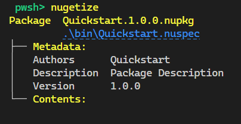

# Quickstart

NuGetizer is a drop-in replacement for the .NET SDK built-in Pack (a.k.a. "SDK Pack"), which instantly supercharges your ability to customize and extend the packing process in a consistent and easy to understand process designed and centered around best practices in MSBuild design and extensibility.

Yes, this means you'll never need to write a `.nuspec` by hand ever again, no matter how complicated or advanced your packing scenarios are.

Since packing is an exercise in getting the resulting .nupkg to contain exactly what you expect it to contain, *NuGetizer* provides a .NET global tool that allows you to quickly and iteratively test your packing scenarios, without incurring in lengthy builds, zipping and subsequent unzipping of the .nupkg for each attempt and so on. 

Install the tool like any other .NET global tool with:

```
dotnet tool install -g dotnet-nugetizer
```

Afterwards, from a directory containing your solution or project, just run `nugetize`. This 
will provide a quick render of the package metadata, dependencies and contents, 
such as:


> [!TIP]
> For added convenience in exploring **NuGetizer**'s capabilities, you can run all 
the examples in this documentation directly in your browser in a  
[](https://github.com/codespaces/new?hide_repo_select=true&ref=docs&repo=297430130&machine=basicLinux32gb&devcontainer_path=.devcontainer%2Fdevcontainer.json)

Getting started is really easy with powerful (yet flexible) built-in [package contents inference](TODO://inference) and a few properties and item metadata that are named and used consistently in a wide variety of common MSBuild items:

| Item Metadata | Description |
|---------------|-------------|
| Pack          | Whether to pack an item. (`true`\|`false`) |
| PackagePath   | The relative path of the file within the package. Implicitly means `Pack=true`. |
| PackFolder    | The [known folder](TODO://LINK) within the package where the file will be placed. Implicitly means `Pack=true`. Useful in combination with `FrameworkSpecific`.|
| FrameworkSpecific | Whether the `PackFolder` should be considered as framework-specific. (`true`\|`false`) |

If an item is *framework-specific*, the project's `TargetFramwework` will be used to calculate the final `PackagePath` automatically (i.e. `/lib/netstandard2.0/Lib.dll` or `/contentFiles/cs/net7.0-android/Api.cs`).

For example, to prevent a `<PackageReference>` from becoming a package dependency, you can just add `Pack="false"` to it. Likewise, to include an arbitrary file in the package, you can just add `Pack=true` to a `<None>` item:

```xml
<ItemGroup>
    <None Include="sample.md" Pack="true" />
</ItemGroup>
```

If you want to include the item at a specific path, you would instead use `PackagePath`:

```xml
<ItemGroup>
    <None Include="sample.md" PackagePath="docs/samples/sample.md" />
</ItemGroup>
```

Or pack an entire folder: 

```xml
<ItemGroup>
    <None Include="docs/**/*.*" PackFolder="docs" />
</ItemGroup>
```

The following are some of the project properties affecting package inference defaults:

| Properties | Description |
|---------------|-------------|
| PackBuildOutput| Whether to pack the project's build output. (Default `true`) |
| BuildOutputFrameworkSpecific | Whether the project-s build output shoud be considered framework-specific. |
| PackSymbols     | true if PackBuildOutput=true (*) |
| PackFolder    | The [known folder](TODO://LINK) within the package where the project's build output will be placed. (Default `lib`) |
| PackContent   | Whether to pack `Content` items. (Default `false`) |
| PackNone      | Whether to pack `None` items. (Default `false`) |
| PackReadme    | Whether to pack a `readme.md` file alongside the project. (Default `true`) |
| PackDependencies        | Whether to process package references. (Default `''`, treated as `true`) |
| PackFrameworkReferences | Whether to pack framework Reference items. (Default `true` if `PackFolder=lib`, `false` if `PackDependencies=false`) |
| PackProjectReferences | Whether to process project references. (Default `true`) |

Default value for `PackContent` is actually smarter: it defaults to `true` if the `Content` items have a non-empty `CopyToOutputDirectory` value.

Default value for `PackNone` is equally smarter too: it defaults to `true` if project's `PackFolder` is `build` or `buildTransitive`, since that's the default item type for `.props` and `.targets` files in the .NET SDK and in build-targeting projects, it's the more sensible default.

`BuildOutputFrameworkSpecific` default value depends on the `PackFolder` and is the same as for `FrameworkSpecific` item metadata:

| PackFolder       | FrameworkSpecific |
|------------------|-------------------|
| content (*)      | true              |
| lib              | true              |
| dependency (**)  | true              |
| frameworkReference (**) | true       |
| build            | false             |
| all others (***) | false             |

\* Since the plain *content* folder [is deprecated as of NuGet v3+](https://docs.nuget.org/ndocs/schema/nuspec#using-the-contentfiles-element-for-content-files), we use *content* to mean *contentFiles* throughout the docs, targets and implementation. They are interchangeable in NuGetizer and always mean the latter.

\** *dependency* and *frameworkReference* are pseudo folders containing the package references and framework (`<Reference ...`) references.

\*** tool(s), native, runtime(s), ref, analyzer(s), source/src, any custom folder.


## Project References

NuGetizer allows each project to determine its contribution to a package by using the items and properties mentioned above. This feature works across project references too (unless `PackProjectReferences=false`).

Given the following projects:

`Core.csproj`:

[!code-xml[](docs/scenarios/quickstart/projectreference/core/Core.csproj)]

`Common.csproj`:
  
[!code-xml[](docs/scenarios/quickstart/projectreference/common/Common.csproj)]

The `Core` package would contain:


As you can see, `Common.csproj`'s contribution (a netstandard library) has now become part of the referencing project/package. Neither project changed the default `PackFolder`, so both are contributing `lib` content. But since the packing project is `Core`, it multi-targets and `lib` content is framework-specific by default, both end up as the `lib` contents of each of the targeted frameworks.

If you add a `PackFolder=build` property to `Common.csproj` (and perhaps add a targets file and build tasks too):

[!code-xml[](docs/scenarios/quickstart/projectbuild/common/Common.csproj?highlight=5,10)]

the package contents would instead become:


Finally, if you set a `PackageId` on `Common.csproj`, its content would now be part of a package *dependency* instead, since the project would be producing its own package now:

[!code-xml[](docs/scenarios/quickstart/projectdependency/common/Common.csproj?highlight=5)]


And you can turn the dependency into a non-framework specific one (since it's build targets/tasks and might apply to more than just the targeted frameworks) by annotating the project reference:

[!code-xml[](docs/scenarios/quickstart/projectdependency-no-tf/core/Core.csproj?highlight=13)]


Finally, you could exclude the project reference entirely from packing by setting `<ProjectReference ... Pack="false" />`, like for any other item type. 

## Package References

Package references become package dependencies by default (unless `PackDependencies=false`), which match the target framework of the project. This is a sensible default for `lib` projects, as we have seen in the previous section.

Sometimes, you need to ship your dependency's files alongside your main library for things to work properly. In such cases, you can use the built-in `PrivateAssets=all` metadata on the `PackageReference`, which causes the resolved assets from the dependency to become part of the primary (build) output of the project. 

For example, a build targets/tasks project like:

[!code-xml[](docs/scenarios/quickstart/privateassets/Jsonator.csproj?highlight=11)]

Would result in a package with:


This also works transitively. For a more complex dependency, such as [Microsoft.Extensions.Configuration](https://nuget.org/packages/Microsoft.Extensions.Configuration) which brings other dependencies in turn:

[!code-xml[](docs/scenarios/quickstart/privateassets-transitive/Jsonator.csproj?highlight=12)]

We would get the following package contents:


## Content and CopyToOutputDirectory

The simplest way to include arbitrary files alongside your project main build output is to set `CopyToOutputDirectory=PreserveNewest`. This will cause the items to end up in your output directory:

[!code-xml[](docs/scenarios/quickstart/content/Quickstart.csproj?highlight=13)]

Intuitively, they will also end up alongside your primary build output package folder:


> [!WARNING]
> It's highly advisable that you *never* use `CopyToOutputDirectory=Always`, since it can impact incremental build performance quite significantly and there's rarely a good reason for using it over `PreserveNewest`.

If you change the pack folder for the project, the content files will "follow" it. This project includes a [Scriban](https://nuget.org/packages/Scriban) template for code generation alongside the build tasks and targets which could use it to emit some code at build time, for example: 

[!code-xml[](docs/scenarios/quickstart/content-scriban/Quickstart.csproj?highlight=6,12,16)]

Note how we're updating the `<Content>` items and using a wildcard, since files ending in `txt` are already added by the .NET SDK as content:


NuGetizer is effectively setting (implicitly) the `PackFolder` of your items to that of the project, whenever you use `CopyToOutputDirectory=PreserveNewest`. This also works for other item types, such as `None` (as long as they are packable, that is, they have a `Pack=true` metadata too, or the project specifies `PackNone=true`).

In addition, the packed files for these items will point to the location in the project's output folder, rather than the source location. This makes it easier to have custom build behavior that might modify the item after copying to the output directory (such as updating a version number in targets). You can see this by opening the generated `.nuspec` in the NuGetizer output.


### ContentFiles

Beyond the previous very simple scenario, however, [content files in a package](https://docs.nuget.org/ndocs/schema/nuspec#using-the-contentfiles-element-for-content-files) have much more flexibility through attributes that affect packaging and their inclusion in consumers' projects. NuGetizer supports these in an intuitive way through item metadata on `<Content>` MSBuild items, namely: `BuildAction`, `CopyToOutput` and `Flatten` item metadata. 

> [!TIP]
> The packing attribute `CopyToOutput` is different than `CopyToOutputDirectory`. When you use the latter, you are implicitly changing the item's `PackFolder` from `Content` to the project's. Therefore, the content packing attributes will not apply.

The package path of content files should also contain the [code language and target framework](https://docs.microsoft.com/en-us/nuget/reference/nuspec#package-folder-structure) they apply to, to control more precisely their inclusion in consuming projects, such as `contentFiles/cs/netstandard2.0/MyApi.cs` (to reference the file only for projects with C# language, targeting `netstandard2.0` or a compatible framework). You can control those with `CodeLanguage` and `TargetFramework` item metadata:

[!code-xml[](docs/scenarios/quickstart/contentfiles/Quickstart.csproj?highlight=13-18)]


By default, the target framework subfolder matches the project's. This can be changed by adding `TargetFramework="any"` metadata on the item, as shown above.

One common scenario is creating source-only packages, where the API is provided as source code directly to consuming projects. To make this process straightforward, NuGetizer defaults `Compile` items' metadata to `PackFolder="content" BuildAction="Compile" CodeLanguage="$(DefaultLanguageSourceExtension)" TargetFramework="$(TargetFramework)"`. This means that by default, all the relevant item metadata for packing compile is already in place. All you need to do is turn packing on for those items by setting `PackCompile=true` in the project:

[!code-xml[](docs/scenarios/quickstart/content-compile/Quickstart.csproj?highlight=6-7)]

> [!TIP]
> In this scenario, it's most common to also set `PackBuildOutput=false` to avoid packing the compiled version.


Since the packing is separate from the project building itself, you still have a project that compiles, can be referenced by unit tests and so on. This makes it very easy to create multi-targeting source-only packages reliably!


## Packaging Projects

More often than not, a non-trivial package is made up of multiple projects, contributing multiple types of assets (i.e. main library project, analyzers/source generators project, build/tasks project, additional tools). Trying to accomodate every scenario from within a single "top-level" library project can be tricky and not very productive or maintainable.

NuGetizer supports the SDK-style `.msbuildproj` project file type which has built-in support in Visual Studio. It can use the `Microsoft.Build.NoTargets` SDK as follows:

[!code-xml[](docs/scenarios/quickstart/packaging/Quickstart.msbuildproj)]

> [!NOTE]
> The requirement of a `TargetFramework` comes from the underlying SDK and the .NET SDK targets themselves, but this kind of project will not build any output. 



In addition to referencing any of the projects shown in this Quickstart, packaging projects can also reference other packaging projects in turn for complex packing scenarios too.

The following is a fairly comprehensive example of a packaging project, including references to build/tasks project, code analysis projcet, multi-targeting main library and additional tools:

[!code-xml[](docs/scenarios/quickstart/packaging-complete/Package/Quickstart.msbuildproj)]

Which produces the following content:

