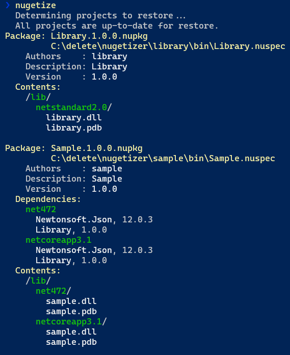

<h1 id="nugetizer">  nugetizer</h1>

Simple, flexible, intuitive and powerful NuGet packaging.

[](https://www.nuget.org/packages/NuGetizer)
[](https://www.nuget.org/packages/NuGetizer)
[](https://github.com/kzu/nugetizer/blob/main/LICENSE)
[](https://github.com/kzu/nugetizer)

[](https://pkg.kzu.io/index.json)
[](https://github.com/kzu/nugetizer/actions?query=branch%3Amain+workflow%3Abuild+)


# Why

The .NET SDK has built-in support for packing. The design of its targets, property 
and item names it not very consistent, however. When packing non-trivial solutions 
with multiple projects, it's quite hard to actually get it to pack exactly the 
way you want it to.

An [alternative clean and clear design](https://github.com/NuGet/Home/wiki/NuGetizer-3000) 
was proposed and I got to implement the initial spec, but it never got traction 
with the NuGet team.

# What

With the learnings from years of building and shipping packages of different 
levels of complexity, as well as significant use of the SDK Pack functionality 
and its various extension points, NuGetizer takes a fresh look and exposes a 
clean set of primitives so that you never have to create `.nuspec` files again.

All the [built-in properties](https://docs.microsoft.com/en-us/nuget/reference/msbuild-targets#pack-target) 
are supported.

A key difference is that adding arbitrary content to the package is supported 
with the first-class `PackageFile` item for absolute control of the package 
contents.

```xml
<ItemGroup>
    <PackageFile Include=".." PackagePath="..." />
</ItemGroup>
```

Another key design choice is that any package content inference should be trivial 
to turn off wholesale in case the heuristics don't do exactly what you need. Just set 
`EnablePackInference=false` and you will only get explicit `PackageFile` items 
in your package. This gives you ultimate control without having to understand any of the inference rules explained below. 

All [inference rules are laid out in a single .targets](src/NuGetizer.Tasks/NuGetizer.Inference.targets) file that's easy to inspect them to learn more, and the file is not imported at all when `EnablePackInference=false`.

## dotnet-nugetize

Carefully tweaking your packages until they look exactly the way you want them should not be a tedious and slow process. Even requiring your project to be built between changes can be costly and reduce the speed at which you can iterate on the packaging aspects of the project. Also, generating the final `.nupkg`, opening it in a tool and inspecting its content, is also not ideal for rapid iteration.

For this reason, NuGetizer provides a dotnet global tool to make this process straightforward and quick. Installation is just like for any other dotnet tool:

```
> dotnet tool install -g dotnet-nugetize
```

After installation, you can just run `nugetize` from the project directory to quickly get a report of the package that would be generated. This is done in the fastest possible way without compromising your customizations to the build process. They way this is achieved is by a combination of a simulated [design-time build](https://github.com/dotnet/project-system/blob/master/docs/design-time-builds.md) that skips the compiler invocation and avoids the output file copying entirely, and built-in support in NuGetizer to emit the entire contents of the package as MSBuild items with full metadata, that the tool can use to render an accurate report that contains exactly the same information that would be used to emit the final `.nupkg` without actually generating it.

Here's a sample output screenshot:



## Inner Devloop

Authoring, testing and iterating on your nuget packages should be easy and straightforward. NuGetizer makes it trivial to consume your locally-built packages from a sample test project to exercise its features, by automatically performing the following cleanups whenever you build a new version of a package:

   a. Clean previous versions of the same package in the package output path
   b. Clean NuGet cache folder for the package id (i.e. *%userprofile%\.nuget\packages\mypackage*)
   c. Clean the NuGet HTTP cache: this avoids a subsequent restore from a consuming project from getting a cached older version, in case you build locally the same version number that was previously restored.

This means that to iterate quickly, these are the only needed steps:

  1. Build/Pack a new version
  2. Run Restore/Build on the sample project


To make the process smoother, consider the following tweaks:

  * Use single `PackageOutputPath`: if you create multiple packages, it's helpful to place them all in a single output directory. This can be achieved easily by adding the property to a `Directory.Build.props` file and place it at your repository root (or your `src` folder).:

    ```xml
    <PackageOutputPath Condition="'$(PackageOutputPath)' == ''">$(MSBuildThisFileDirectory)..\bin</PackageOutputPath>
    ```

  * Use `<RestoreSources>` in your consuming/test projects: this allows you to point to that common folder and even do it selectively only if the folder exists (i.e. use local packages if you just built them, use regular feed otherwise). You can place this too in a `Directory.Build.props` for all your consuming sample/test projects to use:

    ```xml
    <RestoreSources>https://api.nuget.org/v3/index.json;$(RestoreSources)</RestoreSources>
    <RestoreSources Condition="Exists('$(MSBuildThisFileDirectory)..\..\bin\')">
      $([System.IO.Path]::GetFullPath('$(MSBuildThisFileDirectory)..\..\bin'));$(RestoreSources)
    </RestoreSources>
    ```

## Package Contents Inference

Package content inference provides some built-in heuristics for common scenarios so you 
don't have to customize the project much and can instead let the rules build up the contents 
of your package by interpreting your existing project elements. It works by transforming various built-in 
items into corresponding `PackageFile` items, much as if you had added them by hand.

Inference can be turned off for specific items by just adding `Pack="false"` 
item metadata. It can also be turned off by default for all items of a given type with an item definition group:

```xml
<ItemDefinitionGroup>
  <PackageReference>
    <Pack>false</Pack>
  </PackageReference>
</ItemDefinitionGroup>
```

The basic item metadata that drive pack inference are:

1. **Pack**: *true*/*false*, determines whether inference applies to the item at all.
2. **PackagePath**: final path within the package. Can be a directory path ending in `\` and in that case the item's *RelativeDir*, *Filename* and *Extension* will be appended automatically. Linked files are also supported automatically.

If the item does **not** provide a *PackagePath*, and *Pack* is not *false*, the inference targets wil try to determine the right value, based on the following additional metadata:

a. **PackFolder**: typically one of the [built-in package folders](https://github.com/NuGet/NuGet.Client/blob/dev/src/NuGet.Core/NuGet.Packaging/PackagingConstants.cs#L19), such as *build*, *lib*, etc.
b. **FrameworkSpecific**: *true*/*false*, determines whether the project's target framework is used when building the final *PackagePath*.
c. **TargetPath**: optional PackFolder-relative path for the item. If not provided, the relative path of the item in the project (or its *Link* metadata) is used.


When an item specifies *FrameworkSpecific=true*, the project's target framework is added to the final package path, such as `lib\netstandard2.0\My.dll`. Since the package folder itself typically determines whether it contains framework-specific files or not, the *FrameworkSpecific* value has sensible defaults so you don't have to specify it unless you wnat to override it. The [default values from NuGetizer.props](src/NuGetizer.Tasks/NuGetizer.props) are:

| PackFolder       | FrameworkSpecific |
|------------------|-------------------|
| content (*)      | true              |
| lib              | true              |
| dependency (**)  | true              |
| frameworkReference (**) | true       |
| build            | false             |
| all others (***) | false             |

\* Since the plain *content* folder [is deprecated as of NuGet v3+](https://docs.nuget.org/ndocs/schema/nuspec#using-the-contentfiles-element-for-content-files), we use *content* to mean *contentFiles* throughout the docs, targets and implementation. They are interchangeable in NuGetizer and always mean the latter.

\** *dependency* and *frameworkReference* are pseudo folders containing the package references and framework (`<Reference ...`) references.

\** tool(s), native, runtime(s), ref, analyzer(s), source/src, any custom folder.

The `PackFolder` property (at the project level) determines the *PackFolder* metadata value for the build outputs of the project (and its xml docs, pdb and other related files like satellite assemblies). It defaults to `lib`.

For files that end up mapping to *content*, you can also specify *BuildAction*, *CopyToOutput* and *Flatten* item metadata, [as supported by NuGet v4+](https://docs.nuget.org/ndocs/schema/nuspec#using-the-contentfiles-element-for-content-files). In addition to those, NuGetizer also supports *CodeLanguage* and *TargetFramework* to [control the subfolders](https://docs.microsoft.com/en-us/nuget/reference/nuspec#package-folder-structure) too.

Since it wouldn't be much fun having to annotate everything with either *PackFolder* or *PackagePath* (and also the additional *content* file metadata as needed), most common item types have sensible defaults too, defined in [NuGetizer.Inference.targets](src/NuGetizer.Tasks/NuGetizer.Inference.targets). 

| ItemType        | Default Metadata  |
|------------------|-------------------|
| Content<br/>EmbeddedResource<br/>ApplicationDefinition<br/>Page<br/>Resource<br/>SplashScreen<br/>DesignData<br/>DesignDataWithDesignTimeCreatableTypes<br/>CodeAnalysisDictionary<br/>AndroidAsset<br/>AndroidResource<br/>BundleResource | PackFolder="content" <br/>BuildAction="[*ItemType*]" |
| None             | PackFolder="" <br/>BuildAction="None"         |
| Compile          | PackFolder="content" <br/>BuildAction="Compile"<br/>CodeLanguage="$(DefaultLanguageSourceExtension)"                |

`None` is sort of special in that the package folder is root of the package by default.

Whether items are packed by default or not is controlled by properties named after the item type (such as `PackEmbeddedResource`, `PackNone` and so on). Except for the ones below, they all default to *false* (or more precisely, empty, so, not *true*).

| Property        | Default Value |
|-----------------|---------------|
| PackBuildOutput | true |
| PackSymbols     | true if PackBuildOutput=true (*) |
| PackDependencies| empty (**) |
| PackFrameworkReferences | true if PackFolder=lib, false if PackDependencies=false |
| PackProjectReferences | true |


\* Back in the day, PDBs were Windows-only and fat files. Nowadays, portable PDBs 
   (the new default) are lightweight and can even be embedded. Combined with [SourceLink](https://github.com/dotnet/sourcelink), including them in the package (either standalone or embeded) provides the best experience for your users, so it's the default.

\** In some scenarios, you might want to turn off packing behavior for all PackageReference and FrameworkReferences alike. Setting PackDependencies=false achieves that.


The various supported item inference are surfaced as `<PackInference Include="Compile;Content;None;..." />` items, which are ultimately evaluated together with the metadata for the individual items. These make the package inference candidates. You can also provide an exclude expression for that evaluation so that certain items are excluded by default, even if every other item of the same type is included. For example, to pack all `Content` items, except those in the `docs` folder, you can simply update the inference item like so:

```xml
<ItemGroup>
  <PackInference Update="Content" PackExclude="docs/**/*.*" />
</ItemGroup>
```

Of course you could have achieved a similar effect by updating the Content items themselves too instead:

```xml
<ItemGroup>
  <Content Update="docs/**/*.*" Pack="false" />
</ItemGroup>
```

By default (see [NuGetizer.Inference.props](src/NuGetizer.Tasks/NuGetizer.Inference.props)), `Compile` has the following exclude expression, so generated intermediate compile files aren't packed:

```xml
<ItemGroup>
  <PackInference Include="Compile"
                 PackExclude="$(IntermediateOutputPath)/**/*$(DefaultLanguageSourceExtension)" />
</ItemGroup>
```


### CopyToOutputDirectory

There is a common metadata item that's used quite frequently: *CopyToOutputDirectory*, which is typically set to *PreserveNewest* to change it from its default behavior (when empty or set to *Never*).

> NOTE: if you're using *Always*, you're likely ruining your build performance for no reason.

When copying items to the output directory, you're implicitly saying that those items are needed in order to run/execute the built output. For example, if you have build targets/props in a build-only project (i.e. the one that builds the tasks), then those files are needed alongside the built output when packaging.

Given this common scenario, NuGetizer changes the default `PackFolder` metadata for packable items (i.e. those with explicit `Pack=true` metadata or defaulted to *true*, such as `Content` items) to match the `PackFolder` property defined for the project's built output, whenever `CopyToOutputDirectory` is not empty or *Never*.

Like other default inference behaviors, you can always opt out of it by specifying an explicit *PackFolder` item metadata.

In addition, the resulting `PackageFile` items for these items point to the location in the project's output folder, rather than the source location. This makes it easier to have custom behavior that might modify the item after copying to the output directory.

### PackageReference

Package references are turned into package dependencies by default (essentially converting `<PackageReference>` to `<PackageFile ... PackFolder="Dependency">`), unless `PackDependencies` property is `false`. If the package reference specifies `PrivateAssets="all"`, however, it's not added as a dependency. Instead, in that case, all the contributed files to the compilation are placed in the same `PackFolder` as the project's build output (if packable, depending on `PackBuildOutput` property).

Build-only dependencies that don't contribute assemblies to the output (i.e. analyzers or things like [GitInfo](https://github.com/kzu/GitInfo) or [ThisAssembly](https://github.com/kzu/ThisAssembly) won't cause any extra items.

This even works transitively, so if you use *PrivateAssets=all* on package reference *A*, which in turn has a package dependency on *B* and *B* in turn depends on *C*, all of *A*, *B* and *C* assets will be packed. You can opt out of the transitive packing with `PackTransitive=false` metadata on the `PackageReference`.

As usual, you can change this default behavior by using `Pack=false` metadata.

### ProjectReference

Unlike SDK Pack that [considers project references as package references by default](https://docs.microsoft.com/en-us/nuget/reference/msbuild-targets#project-to-project-references), NuGetizer has an explicit contract between projects: the `GetPackageContents` target. This target is invoked when packing project references, and it returns whatever the referenced project exposes as package contents (including the inference rules above). If the project is *packable* (that is, it produces a package, denoted by the presence of a `PackageId` property or `IsPackable=true`, for compatibility with SDK Pack), it will be packed as a dependency/package reference instead.

This means that by default, things Just Work: if you reference a library with no `PackageId`, it becomes part of whatever output your main project produces (analyzer, tools, plain lib). The moment you decide you want to make it a package on its own, you add the required metadata properties to that project and it automatically becomes a dependency instead.

This works flawlessly even when multi-targeting: if the main (packable) project multitargets `net472;netcoreapp3.1`, say, and it references a `netstandard2.0` (non-packable) library, the package contents will be:

```
  /lib/
    net472/
      library.dll
      library.pdb
      sample.dll
      sample.pdb
    netcoreapp3.1/
      library.dll
      library.pdb
      sample.dll
      sample.pdb
```

If the packaging metadata is added to the library, it automatically turns to:

```
Package: Sample.1.0.0.nupkg
         ...\Sample.nuspec
    Authors                 : sample
    Description             : Sample
    Version                 : 1.0.0
  Dependencies:
    net472
      Library, 1.0.0
    netcoreapp3.1
      Library, 1.0.0
  Contents:
    /lib/
      net472/
        sample.dll
        sample.pdb
      netcoreapp3.1/
        sample.dll
        sample.pdb
```

Finally, you can focedly turn a project reference build output into a private asset even if it defines a `PackageId` by adding `PrivateAssets=all`. This is very useful for build and analyzer packages, which typically reference the main library project too, but need its output as private, since neither can use dependencies at run-time.

## Advanced Features

This section contains miscelaneous useful features that are typically used in advanced scenarios and 
are not necessarily mainstream.

### Dynamically Extending Package Contents

If you need to calculate additional items to inject into the package dynamically, you can run a target 
before `GetPackageContents`, which is the target NuGetizer uses before packing to determine what needs 
to be included. At this point you can add arbitrary `<PackageFile ... PackagePath=... />` items laying 
out precisely what it is you want to inject into the .nupkg. For example:
    
```xml
<Target Name="AddPackageContents" BeforeTargets="GetPackageContents">
    <PackageFile Include="$(MSBuildProjectDirectory)\..\docs\**\*.md" PackagePath="docs\%(RelativeDir)%(Filename)%(Extension)" />
</Target>
```
    
This example will add all markdown files in a `docs` folder one level above the current project, and 
place them all under the `docs` folder in the `.nupkg`, preserving their original folder structure.
    
### Packing arbitrary files from referenced packages

If you want to pack files from referenced packages, you can simply add `PackageReference` attribute 
to `PackageFile`. Say we want to resuse the awesome icon from the 
[ThisAssembly](https://nuget.org/packages/ThisAssembly) package, we can just bring it in with:

```xml
<ItemGroup>
  <PackageFile Include="icon-128.png" PackagePath="icon.png" PackageReference="ThisAssembly" />
</ItemGroup>
```

The project will need to reference that package too, of course:

```xml
<ItemGroup>
  <PackageReference Include="ThisAssembly" Version="1.0.0" GeneratePathProperty="true" Pack="false" />
</ItemGroup>
```

Note that we had to add the `GeneratePathProperty` to the reference, so that the package-relative 
path `icon-128.png` can be properly resolved to the package install location. You can also set that 
metadata for all your `PackageReference`s automatically by adding the following to your `Directory.Build.props` 
(or .targets): 

```xml
  <ItemDefinitionGroup>
    <PackageReference>
      <!-- This enables referencing arbitrary files from any package by adding PackageReference="" to any packable item -->
      <GeneratePathProperty>true</GeneratePathProperty>
    </PackageReference>
```

Also note that in the scenario shown before, we don't want to pack the reference as a dependency (it's a build-only or development 
dependency package). That is, this feature does not require a package *dependency* for the referenced package content 
we're bringing in.

It even works for inferred content item types, such as `None`:

```xml
<ItemGroup>
  <None Include="icon-128.png" PackageReference="ThisAssembly" />
</ItemGroup>
```

### Skip Build during Pack

If you are building explicitly prior to running `Pack` (and you're not using 
`PackOnBuild=true`), you might want to optimize the process by skipping the 
automatic `Build` run that happens by default when you run `Pack` by setting 
`BuildOnPack=false`. Not building before `Pack` with `BuildOnPack=false` 
can cause the target run to fail since output files expected by the packaging 
might be missing (i.e. the primary output, content files, etc.).

This option is useful in combination with `BuildProjectReferences=false` when 
packing on CI, since at that point all that's run are the P2P protocol involving 
`GetPackageContents`.


## Sponsors

<h3 style="vertical-align: text-top" id="by-clarius">
&nbsp;&nbsp;by&nbsp;<a href="https://github.com/clarius">@clarius</a>&nbsp;
</h3>

*[get mentioned here too](https://github.com/sponsors/devlooped)!*
